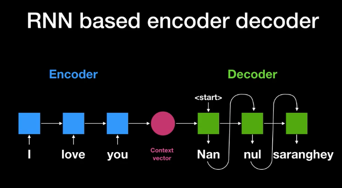
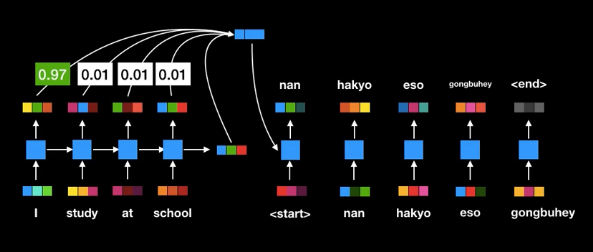
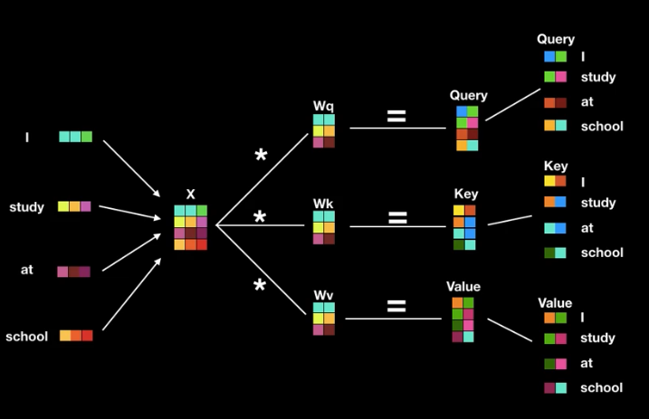
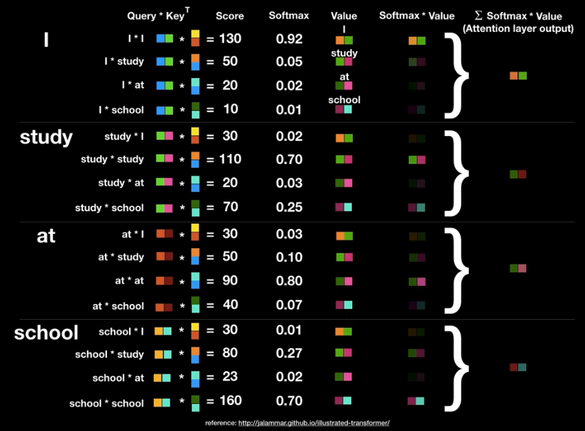
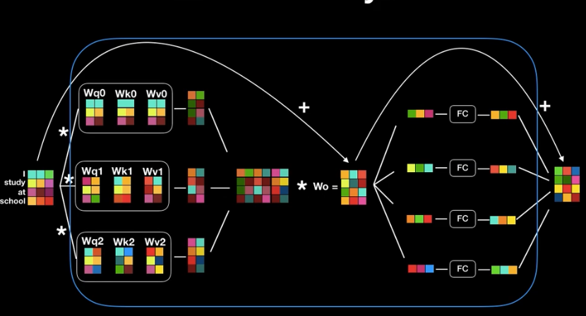
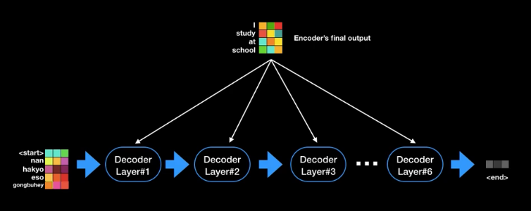
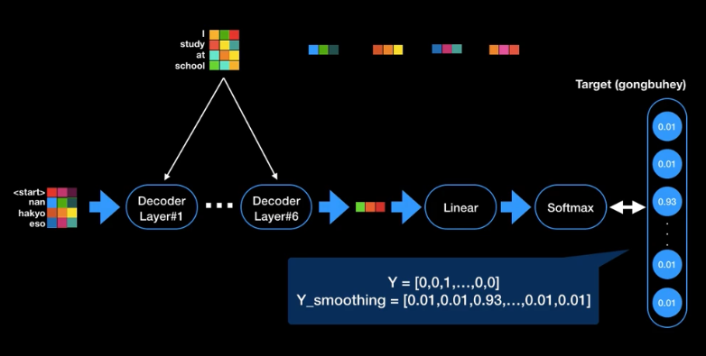
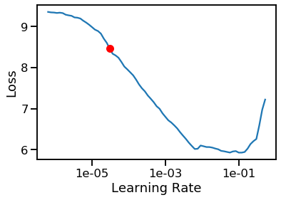
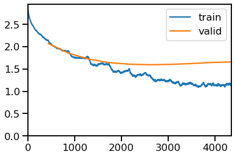

# Machine Translation French to English: 
#### **Implementation of idea proposed in 'Attention Is All You Need' paper**

- [Demo](#demo)
- [Transformer Flow chart](#transformer-flow-chart)
- [why not RNNS ?](#why-not-rnns-)
  - [RNN based translation](#rnn-based-translation)
  - [RNN based translation with Atention](#rnn-based-translation-with-atention)
- [Transform Theory](#transform-theory)
  - [Intiuation behind using various components:](#intiuation-behind-using-various-components)
- [Dataset](#dataset)
- [Training](#training)
  - [Finding suitable learning rate](#finding-suitable-learning-rate)
  - [Loss funtion - Label Smoothing Loss](#loss-funtion---label-smoothing-loss)
  - [Fit through epochs:](#fit-through-epochs)
- [Technlolgies used](#technlolgies-used)
- [Credits:](#credits)
- [Creator](#creator)

## Demo


<p align="center"><i>Demo of working App developed using Streamlit</i></p>

## Transformer Flow chart


## why not RNNS ?
### RNN based translation

A basic Seq2seq model consits of an encoder and decoder. Model takes input sentence into encoder and encodes word by word in each step and outputs hidden state (eh[t]) that stores the context of sentence till that point. so final hiden state at the end (eh[T]) stores context of entire sentence.

This hidden state (eh[T]) becomes input for decoder that decodes the context vector(eh[T]) and produces translated sentence word by word. At each step, decoder outputs word and hidden state(dh[t]) which is will used for generating next word.


 
### RNN based translation with Atention
Above model with **Attention** differs in following things:

* Instead of last hidden state, all the states (eh[0], eh[1]...,eh[T]) at every step along with final context vector (eh[T]) are passed into decoder. Idea here is each hidden state is majorly associated with certain word in the input sentence. using all the hidden state gives better translation.

* At every time step in Decoding phase, Socres are computed for every hidden states (eh[t]) that stores how relevant is particular hidden state in predicting word at current step(t) in this way more importance is given to hidden state that is relevant in predicting current word.

ex: when decoder predicts ist word more importance should be given to 1st hidden, 2nd hidden state (depends on the language struture) od all input hidden states.



This method is significant improvement over prevoius but lacks parallelization capability and thus greater time complexity.

## Transform Theory

It is used for translation i.e seq2seq as Attention model. It is different in following aspects.

1. It can be parallelised unlike Attention. Attention uses RNN as base for encoding the info i.e hidden state. So, last word has to wait till all previous words are processed or encoded in context vector.

2. In transofrmer there is not such concept as hidden state. trnasformer 'Self attention' captures association of certain word with other words in the input sentences. This is achieved by three vectors termed as query, key
, value obtained by multiplying **word embedding** with the weight matrices [unknown param to be estimated] one for each query(q), key(k) and value(v).

Note: To embed word relative position in the sentence. word embedding is added with postional encoding that preserves word position related information. 

3. Then using the q, k and v, attention scores are computed for each word with other words. So each word has one attention vector i.e each words have their own q, k and v matrices.



Wq, Wk, Wv are parameter matrices to be learned to get q, k and v upon multiplying with input embeddings

Attention scores = softmax( dot_product( q[j],k[i] ) / sqrt(T) ) * v(j)

T - dimesion of the key



We can see how attention screens out non relevant inputs for generating each words.

Since inputs for predicting each word in independent of each other they can be parallelized.

Till now we have seen single head attention. we can also use multiple sets of q, k, v for each word for computing individual Attention scores and Finally resulting matrices are concatenated This is called Multi head attention. 



* Attention Scores (vectors) are feed into feed forward network with weight matrices (Wo) to make attention output same dimension as the word embedding. 

As we pass input embedding through many layers postional infomation may be decay. To make up for this we add attention output with input rataining position related information.

This is Encoder's final output is demension as input encoder. We can feed output to another encoder to make model robust. encoder can be stacked in series. Final, output from the last encoder becomes input for decoder. 


simlarly multiple decoders can be stacked in series where first decoder users final output of encoder. Last decoder outputs prediction word.



Inputs to the decoder is passed through the **Masked Multi head Attention** that prevent future words to be part of the attention.

Fro decoder multihead attention layer query matrices are generated within from (prevoius decoder layer) but key and value come from the encoder. Since query changes at every step, so does Attention  telling which  and corvert values to probabilities (softmax). word corresponding index of max probabilty will be output.




### Intiuation behind using various components:

**Positional Encoding**: As the **Tranformer** architecture does not have component to represent sequential nature of the data. This layer is used to inject relative positions of the word in the sequence.

**Self-attention**: word embedding is broke down into *query*, *key* and *value* of same dimension. During training phase, these matrices learns how much other words value it. *query* queries other words and get feedback as *key* which then dot producted with *value* to get the score. This is performed against all other words 

**Multi-Head Attention**: Multiple heads provided a greater fexibility in understanding context as each one of it looks at same input embedding in different context (different Q, K, V) and brougut to same size as input embedding by concatinating. 


**Masked Self-Attention**: Encoder component needs to look at each word in the input sentence to understand context but while decoding, let say predicting 'i' th,  it should be only be allowed to look at previous i-1 words ,otherwise, it would be cheating. It done by masking.

**Encoder-Decoder Attention**: Decoder has to relay on Encoder input for understanding context of the complete sentence. Its achieved by allowing decoder query the encoded embeddings (*key* and *value*) that stores both positional and contextual information. Deocder predicts based on this embedding.

**Encoder-Decoder Stack**: One thing to notice in the **Transformer** network is the dimesions of the encoded embeddings (output of encoder) remains same. In other words it can said that Encoded embedding in as improvised representation of orinal data. It can still be improved by stacking similar layer in sequence.


# Implementation using BERT

The Machine translation task has been implemented using [**BERT**](https://arxiv.org/abs/1810.04805) transformer architecture, which stands for **B**idirectional **E**ncoder **R**epresentations from **T**ransformers. BERT is designed to pre-train deep bidirectional representations from unlabeled text by jointly conditioning on both left and right context in all layers. Hence, It is suiltable for wide range of tasks, such as question answering and language inference, without substantial task-specific architecture modifications.  

## Dataset 

Dataset consists around 30000 pairs of french queries and their translation in English.  

fr | en
---|---
Quelle sorte de poste aimeriez-vous occuper? | What sort of job would you like to be in?
What do adult attachment scales measure? | What do adult attachment scales measure?
Quel mécanisme utiliser pour mettre en œuvre cette protection (par exemple, les principes UDRP ou un autre mécanisme)? | What mechanism should be used to implement protection (for example, the UDRP or some other mechanism)?
Qu'arrive-t-il si les registres d'un organisme de bienfaisance ne sont pas satisfaisants? | What happens if a charity's records are inadequate?
À votre avis, pourquoi est-il important que les gouvernements gèrent les terres et les rivières? | What type of activities threaten the animals or plants in a national park?


**Model input Parametes**:

``` python
{'src_vocab_size': 22188,
 'tgt_vocab_size': 14236,
 'd_model': 300,
 'd_ff': 2048,
 'd_k': 64,
 'd_v': 64,
 'n_heads': 6,
 'n_layers': 6}
```

1. **src_vocab_size** - source language vocabulary size
2. **tgt_vocab_size** - target language vocabulary size
3. **d_model** - dimension of hidden units
4. **d_ff** - dimension of the decoder's feed-forward output
5. **d_k** - dimension of *key* vector 
6. **d_v** - dimension of *value* vector
7. **n_heads** - No of units in the Multihead attention
8. **n_layers** - No of layers in the Multi-Head attention units inside Encoder and decoder


## Training

### Finding suitable learning rate
* Selecting learning rate using ```lr_find```, a **fastai** utility.



```5e-4``` is the value choosen for learning rate

### Loss funtion - Label Smoothing Loss
Label Smoothing Loss is used as loss criteria. Authours point out in the paper that using label smoothing helped getting a better BLEU/accuracy, even if it made the loss worse.

### Fit through epochs:

The model is trained using ```fit_one_cycle``` method which is the implementation of implementation of popular **one cycle policy** technique. 


<center><i><b> n_baches vs loss</b></i></center><br>


**Validation results**: 
epoch | train_loss | valid_loss | seq2seq_acc | bleu | time
------|------------|------------|-------------|------|-----
0 | 2.456067 | 2.653436 | 0.612640 | 0.433706 | 01:28
1 | 2.041358 | 2.261911 | 0.642574 | 0.462979 | 01:28
2 | 1.675195 | 1.926699 | 0.680742 | 0.488075 | 01:28
3 | 1.384582 | 1.713956 | 0.702641 | 0.511958 | 01:31
4 | 1.127888 | 1.588813 | 0.723198 | 0.536749 | 01:33
5 | 0.813250 | 1.529009 | 0.734520 | 0.553977 | 01:37
6 | 0.497641 | 1.541128 | 0.743082 | 0.570197 | 01:32
7 | 0.262595 | 1.580004 | 0.747232 | 0.581183 | 01:31
8 | 0.140268 | 1.620333 | 0.750187 | 0.587652 | 01:31
9 | 0.086930 | 1.639049 | 0.750771 | 0.589219 | 01:32


## Technlolgies used


[](https://pytorch.org/)
[]()
[](https://github.com/google-research/bert)
[](https://www.streamlit.io/)


</br>

## Credits:
1. [Attention Is All You Need - Paper (arxiv)](https://arxiv.org/abs/1706.03762)

2. [**harvardnlp** - The Annotated Transformer](http://nlp.seas.harvard.edu/2018/04/03/attention.html)
2. [Fastai - Introduction to Transformer](https://www.youtube.com/watch?v=KzfyftiH7R8&list=PLtmWHNX-gukKocXQOkQjuVxglSDYWsSh9&index=18)

3. [Transformer (Attention is all you need) - Minsuk Heo 허민석](https://www.youtube.com/watch?v=z1xs9jdZnuY&t=182s)

</br>

------
## Creator
[](https://skumar-djangoblog.herokuapp.com/)
